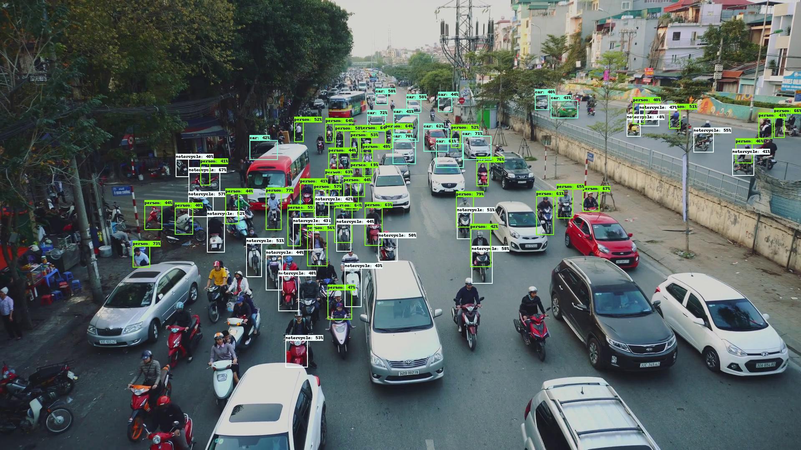
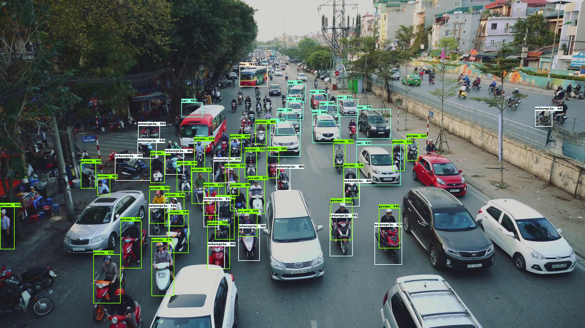
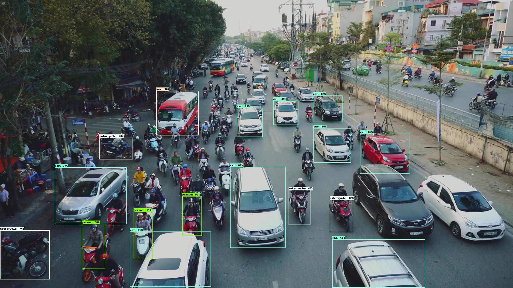
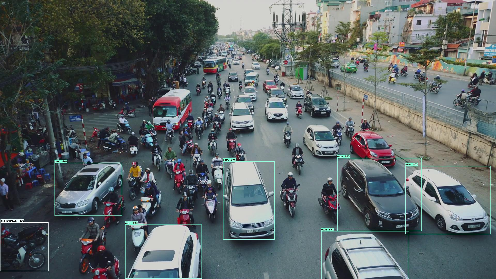

# EfficientDet-lab

This repository provides an easy way to do experiments with EfficientDet object detector. EfficientDet uses Feature Pyramid
Network (FPN) to deal with different object scales. There are 5 FPN levels, P3-P7, each level can detect objects with
different scales. I have modified [original implementation of EfficientDet](https://github.com/google/automl)
so that one can easily connect or disconnect different FPN levels to test their contribution in detecting objects.

```
python efficientdet/keras/inspector.py \
                          --mode=infer \
                          --model_name=efficientdet-d0 \
                          --model_dir=path-to-model \
                          --output_image_dir=/tmp \
                          --input_image=img.png \
                          --image_size=1920 \
                          --fpn_levels=FPN-levels
```
FPN-levels specify feature pyramid levels to be used during the inference.


## Example:
* Use three FPN levels, 3, 4, 5 :
```
python efficientdet/keras/inspector.py \
                          --mode=infer \
                          --model_name=efficientdet-d0 \
                          --model_dir=path-to-model \
                          --output_image_dir=/tmp \
                          --input_image=img.png \
                          --image_size=1920 \
                          --fpn_levels=3,4,5
```

## Case study:
Let's take the following image and see how different FPN levels, 3-7, contribute in detecting objects.

* Input image:
  


* L3



* L4 



* L5 



* L6



* L7


